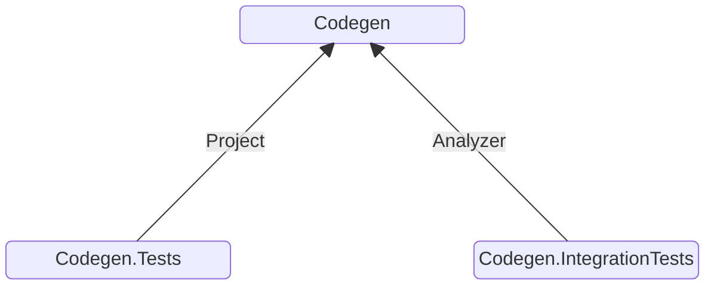
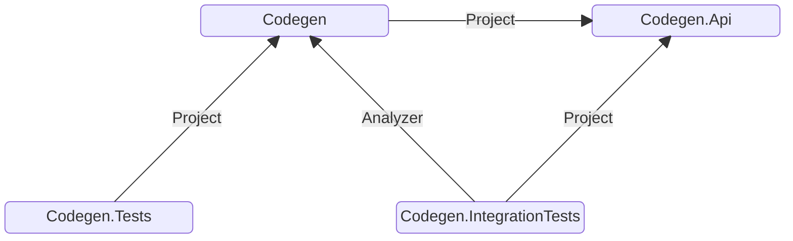

<div class="max-w-80%">

# The art of automation
## An introduction to compile-time C# code generation
</div>

<div class="text-black">
Daniel Raniz Raneland<br />
Coding Architect @ factor10

<div class="grid grid-cols-2 w-80% mt-10">
    <div class="col-span-2"><mdi-firefox />factor10.com</div>
    <div class="col-span-2"><mdi-firefox />raniz.blog</div>
    <div class="col-span-2"><mdi-email />raniz@factor10.com</div>
</div>
</div>

<div class="absolute right-20px bottom-20px text-center">
    
    <div class="col-span-2"><mdi-linkedin />/in/raneland</div>
</div>

---
layout: cover
dim: false
background: /images/code-in-code-meme.jpg
---

---

# Layout

- Demo
- Generating code in C#
- Generating Equals and GetHashCode
- Wrap up

---

# Generating code in C#

- < .NET 5: Custom tooling
- .NET 5: Roslyn source generators
- .NET 6: Incremental source generators

---

# < .NET 5: Custom tooling

- T4 text templates
- Standalone tools invoked via MSBuild
- CodeDOM

---

# .NET 5: Roslyn source generators

- Executed by the C# compiler
- Analyses _all_ source code every time
- _One_ pass - i.e. can't analyse generated code

<!--

Can't see code from other source generators

-->

---

# .NET 6: Incremental source generation

- Executed by the C# compiler
- Only analyses _changed_ source code
- Uses cached results if nothing has changed
- Runs until no more changes are added - i.e. _can_ analyse generated code

<!--

Can see generated code both from itself and other generators

-->

---

# Generating Equals and HashCode

---

# Marker attributes

```csharp
[JsonExample("User")]
private static string UserJson = @"
{
    ""id"": 1,
    ""name"": ""Jane Doe"",
    ""email"": ""jane.doe@acme.com"",
    ""isVerified"": true,
    ""createdAt"": ""2024-09-05T12:34:56Z""
}";
```

---

# Solution layout

<div class="text-center mt-20">



</div>

---

# Codegen

NuGet:

- Microsoft.CodeAnalysis.Analyzers
- Microsoft.CodeAnalysis.CSharp
- Microsoft.CodeAnalysis.CSharp.Workspaces

---

# Codegen.Tests

Projects:

- Codegen

NuGet:
- FluentAssertions
- xunit

---

# Codegen.IntegrationTests

Analyzers:

- Codegen

NuGet:

- FluentAssertions
- xunit

---

# Depending on an analyzer

```xml {all|3|4|5}
<ItemGroup>
    <ProjectReference
            Include="..\Codegen\Codegen.csproj"
            OutputItemType="Analyzer"
            ReferenceOutputAssembly="false"
    />
</ItemGroup>
```

---
layout: video
video: /videos/01-integration-test.mp4
---

---

# Marker attribute inclusion

---

# Marker attribute inclusion
## Separate project

<div class="text-center mt-20">



</div>

---

# Marker attribute inclusion
## Analyzer as dependency

```xml {5}
<ItemGroup>
    <ProjectReference
            Include="..\Codegen\Codegen.csproj"
            OutputItemType="Analyzer"
            ReferenceOutputAssembly="true"
    />
</ItemGroup>
```

---

# Marker attribute inclusion
## Generate it


---
layout: video
video: /videos/02-attribute-generation.mp4
---

---

# Iterative development without rebuilding


---

# Iterative development without rebuilding


---
layout: video
video: /videos/03-test-helper-extension.mp4
---

---
layout: video
video: /videos/04-unit-test.mp4
---

---

# Brittle vs rebuilding all the time

---
layout: video
video: /videos/05-class-generation.mp4
---

---

# Providing source code
## SyntaxFactory

``` 
SyntaxFactory.MethodDeclaration(SyntaxFactory.PredefinedType(SyntaxFactory.Token(SyntaxKind.BoolKeyword)), "Equals")
    .AddModifiers(SyntaxFactory.Token(SyntaxKind.PublicKeyword))
    .AddParameterListParameters(
        SyntaxFactory.Parameter(SyntaxFactory.Identifier("other"))
            .WithType(SyntaxFactory.NullableType(SyntaxFactory.IdentifierName(className))))
    .WithBody(SyntaxFactory.Block(
        SyntaxFactory.ReturnStatement(
            MemberNames
                .Select(name => (ExpressionSyntax) SyntaxFactory.InvocationExpression(SyntaxFactory.IdentifierName("Object.Equals"))
                    .AddArgumentListArguments(
                        SyntaxFactory.Argument(SyntaxFactory.IdentifierName(name)),
                        SyntaxFactory.Argument(SyntaxFactory.MemberAccessExpression(SyntaxKind.SimpleMemberAccessExpression,
                            SyntaxFactory.IdentifierName("other"),
                            SyntaxFactory.IdentifierName(name)))))
                .Aggregate((current, next) => SyntaxFactory.BinaryExpression(SyntaxKind.LogicalAndExpression, current, next))
    )));
```

---
layout: video
video: /videos/06-implementation-source-code.mp4
---

---
layout: video
video: /videos/07-classname-namespace.mp4
---

---
layout: video
video: /videos/08-member-names.mp4
---

---
layout: video
video: /videos/09-first-green-test.mp4
---

---
layout: video
video: /videos/10-more-tests.mp4
---

---
layout: video
video: /videos/11-hashcode-test.mp4
---
