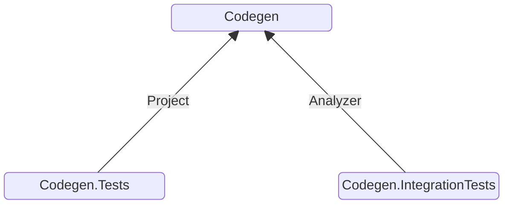
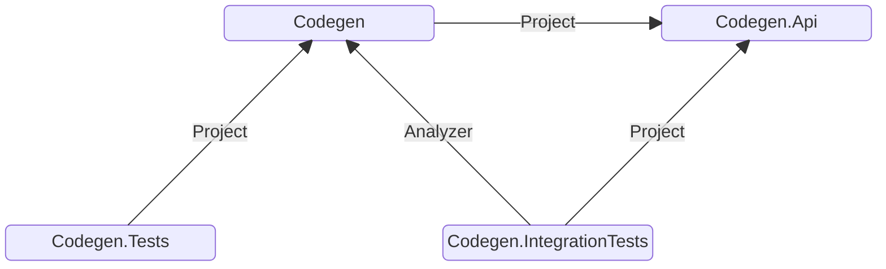

<div class="max-w-80%">

# The art of automation
## An introduction to compile-time C# code generation
</div>

<div class="text-black">
Daniel Raniz Raneland<br />
Coding Architect @ factor10

<div class="grid grid-cols-2 w-80% mt-10">
    <div class="col-span-2"><mdi-firefox />factor10.com</div>
    <div class="col-span-2"><mdi-firefox />raniz.blog</div>
    <div class="col-span-2"><mdi-email />raniz@factor10.com</div>
    <div class="col-span-2"><mdi-linkedin />/in/raneland</div>
</div>
</div>

<div class="absolute right-20px bottom-20px text-center">
    
    <div class="col-span-2">about.me/raniz</div>
</div>

---
layout: cover
dim: false
background: /images/code-in-code-meme.jpg
---

---

# Layout

- Demo
- Generating code in C#
- Generating Equals and GetHashCode
- Wrap up

---
layout: fact
---

# Demo

---

# Generating code in .NET Core
## Some history

-  Before .NET 5: custom tooling
- .NET 5: Roslyn source generators
- .NET 6 and beyond: incremental source generators

---

# Before .NET 5: Custom tooling

- T4 text templates
- Standalone tools invoked via MSBuild
- CodeDOM

---

# .NET 5: Roslyn source generators

- Executed by the C# compiler
- Analyses _all_ source code every time
- _One_ pass - i.e. can't analyse generated code

<!--

Can't see code from other source generators

-->

---

# .NET 6 and beyond: incremental source generation

- Executed by the C# compiler
- Only analyses _changed_ source code
- Uses cached results if nothing has changed
- Runs until no more changes are added - i.e. _can_ analyse generated code

<!--

Can see generated code both from itself and other generators

-->

---
layout: statement
---

# Generating Equals and HashCode

---

# Marker attributes

```csharp
[JsonExample("User")]
private static string UserJson = @"
{
    ""id"": 1,
    ""name"": ""Jane Doe"",
    ""email"": ""jane.doe@acme.com"",
    ""isVerified"": true,
    ""createdAt"": ""2024-09-05T12:34:56Z""
}";
```

---

# Solution layout

<div class="text-center mt-20">


```mermaid
block-beta
columns 3
    space Codegen("Codegen") space
    space:3
    space:3
    space:3
    space:3
    Tests("Codegen.Tests") space ITests("Codegen.IntegrationTests")
    
    Tests -- "Project" --> Codegen
    ITests -- "Analyzer" --> Codegen
```

</div>

---

# Codegen

NuGet:

- Microsoft.CodeAnalysis.Analyzers
- Microsoft.CodeAnalysis.CSharp
- Microsoft.CodeAnalysis.CSharp.Workspaces

---

# Codegen.Tests

Projects:

- Codegen

NuGet:
- FluentAssertions
- xunit

---

# Codegen.IntegrationTests

Analyzers:

- Codegen

NuGet:

- FluentAssertions
- xunit

---

# Depending on an analyzer project

```xml {all|3|4|5}
<ItemGroup>
    <ProjectReference
            Include="..\Codegen\Codegen.csproj"
            OutputItemType="Analyzer"
            ReferenceOutputAssembly="false"
    />
</ItemGroup>
```

---
layout: video
video: /videos/01-integration-test.mp4


<!--

Create integration test that fails because it can't find the marker attribute

-->
---

---

# Marker attribute inclusion

---

# Marker attribute inclusion
## Separate project

<div class="text-center mt-20">


```mermaid
block-beta
columns 4
    space Codegen("Codegen") space Api("Codegen.Api")
    space:4
    space:4
    space:4
    space:4
    Tests("Codegen.Tests") space ITests("Codegen.IntegrationTests") space
    
    Tests -- "Project" --> Codegen
    ITests -- "Analyzer" --> Codegen
    Codegen -- "Project" --> Api
    ITests -- "Project" --> Api
```

</div>

---

# Marker attribute inclusion
## Analyzer as dependency

```xml {5}
<ItemGroup>
    <ProjectReference
            Include="..\Codegen\Codegen.csproj"
            OutputItemType="Analyzer"
            ReferenceOutputAssembly="true"
    />
</ItemGroup>
```

---

# Marker attribute inclusion
## Generate it


---
layout: video
video: /videos/02-attribute-generation.mp4
---

<!--

1. Create generator that generates the attribute
2. Reload Roslyn in Rider to make it get, still doesn't build
3. Rebuild the project

-->

---

# Iterative development without full rebuilds


---

# Iterative development without full rebuilds


---
layout: video
video: /videos/03-test-helper-extension.mp4
---

<!--

Test helper for running the generator on source code from string

-->

---
layout: video
video: /videos/04-unit-test.mp4
---

<!--

Write a unit test using the helper. Show that it's brittle and can fail with error messages that are hard to decipher.

-->

---
layout: two-columns
---

# Integration vs unit tests

::left::

## Integration tests

- Need to rebuild project on change
- Tests functionality, no matter what the implementation looks like
 
::right::

## Unit tests

- Develop normally
- Asserts exact output, can't test functionality

<!--
Brittle unit tests that are fast to execute or rebuilding the project to reload source generators so the integration tests can run?

Stable > fast right here, for me
-->

---
layout: video
video: /videos/05-class-generation.mp4
---

<!--
Implement the source generator to trigger on annotated classes, stop at the actual source generation
-->

---

# Providing source code

<div v-click>

## SyntaxFactory

```csharp
SyntaxFactory.MethodDeclaration(SyntaxFactory.PredefinedType(SyntaxFactory.Token(SyntaxKind.BoolKeyword)), "Equals")
    .AddModifiers(SyntaxFactory.Token(SyntaxKind.PublicKeyword))
    .AddParameterListParameters(
        SyntaxFactory.Parameter(SyntaxFactory.Identifier("other"))
            .WithType(SyntaxFactory.NullableType(SyntaxFactory.IdentifierName(ClassName))))
    .WithBody(SyntaxFactory.Block(
        SyntaxFactory.ReturnStatement(
            MemberNames
                .Select(member => (ExpressionSyntax) SyntaxFactory.InvocationExpression(SyntaxFactory.IdentifierName("Object.Equals"))
                    .AddArgumentListArguments(
                        SyntaxFactory.Argument(SyntaxFactory.IdentifierName(member)),
                        SyntaxFactory.Argument(SyntaxFactory.MemberAccessExpression(SyntaxKind.SimpleMemberAccessExpression,
                            SyntaxFactory.IdentifierName("other"),
                            SyntaxFactory.IdentifierName(member)))))
                .Aggregate((current, next) => SyntaxFactory.BinaryExpression(SyntaxKind.LogicalAndExpression, current, next))
    )));
```

</div>

<!--

There's a bug in here, can you spot it?

-->

---

# Providing source code
## String interpolation

````md magic-move
```csharp
$@"
public bool Equals({ClassName}? other)
{{
    return {" && ".join(MemberNames.Select(name => $"Object.Equals({name}, other.{name})"))};
}}
";
```
```csharp
$@"
public bool Equals({ClassName}? other)
{{
    return other is not null && {" && ".join(MemberNames.Select(name => $"Object.Equals({name}, other.{name})"))};
}}
";
```
````

---

# Providing source code
## Templating

```liquid
public bool Equals({{ ClassName }}? other)
{
    return other is not null
    
        && Object.Equals({{ name }}, other.{{ name }})
    
    ; 
}
```

<!--

Example is a Liquid template

-->

---
layout: video
video: /videos/06-implementation-source-code.mp4
---

<!--

Implement method for generating source code, using properties that are still not defined

-->

---
layout: video
video: /videos/07-classname-namespace.mp4
---

<!--

Define the Classname and Namespace properties

For the namespace we need the _semantic model_, which has resolved the full class hierarchy and is not just working with syntax.

-->

---
layout: video
video: /videos/08-member-names.mp4
---

<!--

Define the member names property

-->

---
layout: two-columns
---

# About property inclusion

::left::

````md magic-move

```csharp {*|*|19|3|5-17|5|6-17|6-17|*}{lines: true}
public class Person
{
    public String Name { get; init; }
    
    private int _age;
    public int Age { 
        init {
            if (value < 0 || value > 130)
            {
                throw new ArgumentException();
            }
            _age = value;
        }
        get {
            return _age;
        }
    }
    
    public bool IsAdult => Age >= 18;
}
```

```csharp
public class Person
{
    public String Name { get; init; }
    
    private int _age;
    [EqualsAndHashCodeIgnore]
    public int Age { 
        init {
            if (value < 0 || value > 130)
            {
                throw new ArgumentException();
            }
            _age = value;
        }
        get {
            return _age;
        }
    }
    
    [EqualsAndHashCodeIgnore]
    public bool IsAdult => Age >= 18;
}
```

````

::right::

<div class="ml-5">

````md magic-move {at: 1}

```csharp
return member is FieldDeclarationSyntax
    or PropertyDeclarationSyntax;
```

```csharp
return member switch {
    FieldDeclarationSyntax => true,
    PropertyDeclarationSyntax => true,
};
```

```csharp
return member switch {
    FieldDeclarationSyntax => true,
    PropertyDeclarationSyntax prop =>
            prop.AccessorList != null,
};
```

```csharp {3-5|*|2|3-5}
return member switch {
    FieldDeclarationSyntax => true,
    PropertyDeclarationSyntax prop => prop.AccessorList
              .Accessors
              .Any(),
};
```

```csharp {3-5}
return member switch {
    FieldDeclarationSyntax => true,
    PropertyDeclarationSyntax prop => prop.AccessorList
              .Accessors
              .All(accessor => accessor.Body is null),
};
```

```csharp
return member switch {
    FieldDeclarationSyntax => true,
    PropertyDeclarationSyntax prop => prop.AccessorList?
              .Accessors
              .All(accessor => accessor.Body is null)
          ?? false,
};
```

```csharp
return member is FieldDeclarationSyntax
    or PropertyDeclarationSyntax
    && !HasIgnoreAttribute(member);
};
```

````

</div>

---
layout: video
video: /videos/09-first-green-test.mp4
---

---
layout: video
video: /videos/10-more-tests.mp4
---

---

# Summary

- Roslyn incremental source generator
- Marker attribute inclusion
- Integration testing vs unit testing
- SyntaxFactory vs string interpolation vs templating
- Techniques for property selection

---

# Applications

<v-clicks>

- Automatic DI modules
- Flavour generation
- Performant serialization
- Aspect-oriented programming
- Generating companion code
- Transforming DSL into code

</v-clicks>

---

# Bonus stuff

- _ForAttributeWithMetadataName_ does not support aliases

```csharp

using Eq = Codegen.EqualsAndHashCodeAttribute;

[Eq]
public partial class Person {

    ...
}
```


---

# Bonus stuff

- _ForAttributeWithMetadataName_ does not support aliases
- Running unit tests with reflection

```csharp
var assembly = generator.CompileToAssembly(sourceCode);

var testSubjectType = assembly.GetType("Test.TestSubject");
dynamic a = Activator.CreateInstance(testSubjectType, ["foo", 7]);
dynamic b = Activator.CreateInstance(testSubjectType, ["foo", 7]);
bool result = a.Equals(b);
result.Should().BeTrue();
```

---
layout: intro
---
<div class="max-w-80%">

# The art of automation
## An introduction to compile-time C# code generation
</div>

<div class="text-black">
Daniel Raniz Raneland<br />
Coding Architect @ factor10

<div class="grid grid-cols-2 w-80% mt-10">
    <div class="col-span-2"><mdi-firefox />factor10.com</div>
    <div class="col-span-2"><mdi-firefox />raniz.blog</div>
    <div class="col-span-2"><mdi-email />raniz@factor10.com</div>
    <div class="col-span-2"><mdi-linkedin />/in/raneland</div>
</div>
</div>

<div class="absolute right-20px bottom-20px text-center">
    
    <div class="col-span-2">about.me/raniz</div>
</div>
